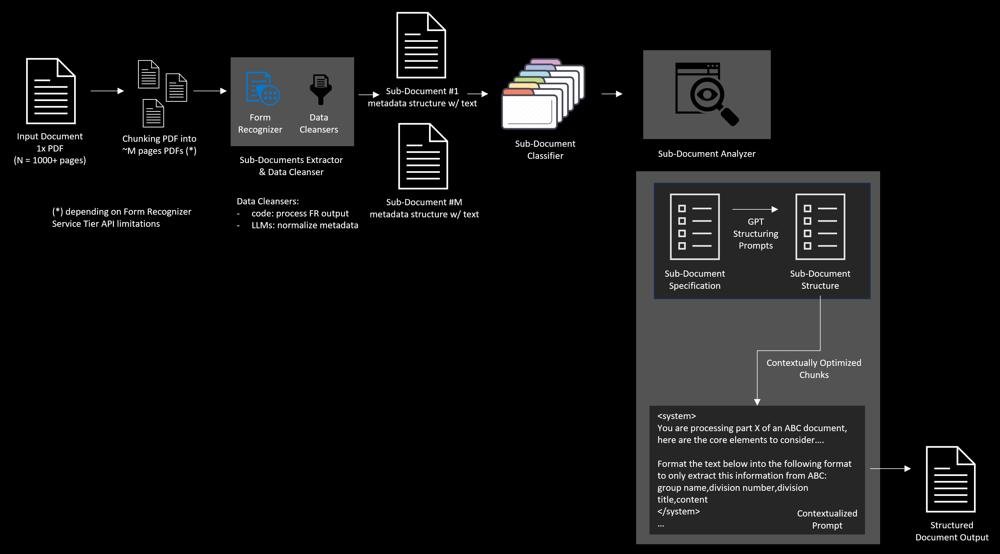

# specs-extractor

## Use Case

Pattern to process parts of a large PDF document into a predefined specific structured format. The source document is expected to be a combination of 1 to N different sub-documents, some of which may need to be processed to generate a specific target structured output.

## Architecture Overview



## Usage

1. Create a 'documents' directory in the root level of this repository and place the PDFs you want to extract in that folder.

2. Copy the documents_formats/*.template files and customize them as .txt files.

3. Copy the prompts/*.template files and customize them as .txt

4. Copy src/.env.template to src/.env and update the values to match your environment.

5. Run the following commands to setup the environment and run the extraction script:

```bash
conda env create -f conda.yml
conda activate specs-extractor
python src/extract.py
```